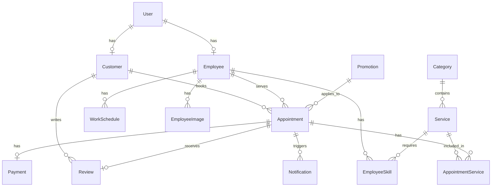

# TÀI LIỆU YÊU CẦU SẢN PHẨM (PRD)
## Hệ thống Website YURI SPA BEAUTY

| Thông tin | Chi tiết |
|---|---|
| **Tên dự án** | YURI SPA BEAUTY - Website Đặt lịch & Quản lý Dịch vụ Spa |
| **Phiên bản** | 2.5 |
| **Ngày tạo** | 14/05/2026 |
| **Cập nhật lần cuối** | 20/05/2026 |
| **Trạng thái** | Phase 2.5 - Production Ready |
| **Production URL** | Vercel (region: sin1) |

---

## 1. Tổng quan dự án

### 1.1 Mục tiêu
Xây dựng hệ thống Website phục vụ cho **1 cơ sở** kinh doanh dịch vụ làm đẹp (Spa, Nail, Massage, Nối mi, Gội đầu, Chăm sóc da) với các mục tiêu:

- Cho phép khách hàng **đặt lịch trực tuyến** 24/7
- Cung cấp hệ thống **quản trị** cho chủ cơ sở: quản lý lịch hẹn, dịch vụ, nhân viên, khách hàng
- Hiển thị thông tin cửa hàng, danh sách dịch vụ, bảng giá, chương trình khuyến mãi
- Hỗ trợ **nhắc lịch tự động** qua Zalo OA
- Giao diện **Mobile-first** cho khách hàng đặt lịch trên điện thoại
- Tích hợp **thanh toán online** VNPay (sandbox)

### 1.2 Đối tượng người dùng

| Vai trò | Mô tả | Quyền hạn |
|---|---|---|
| **Khách hàng** | Người sử dụng dịch vụ Spa | Xem dịch vụ, đặt lịch, đăng ký tài khoản, xem lịch sử, đánh giá |
| **Nhân viên (Staff)** | Nhân viên thực hiện dịch vụ | Xem lịch làm việc cá nhân |
| **Quản trị viên (Admin)** | Chủ/quản lý cơ sở | Toàn quyền quản trị hệ thống |

### 1.3 Công nghệ sử dụng

| Thành phần | Công nghệ |
|---|---|
| Framework | Next.js 16+ (App Router, TypeScript) |
| Database | PostgreSQL (Production - Neon/Supabase) + Prisma ORM |
| Authentication | NextAuth.js v5 beta (Credentials Provider) |
| Styling | Vanilla CSS, Google Fonts (Be Vietnam Pro) |
| Ngôn ngữ giao diện | Tiếng Việt |
| Thanh toán | VNPay (sandbox), MoMo (API route stub) |
| Thông báo | Email (Nodemailer SMTP) + Zalo OA (stub) |
| Validation | Zod |
| Hosting | Vercel (region sin1) |
| Icons | react-icons (Feather Icons) |
| Toast | react-hot-toast |

---

## 2. Kiến trúc hệ thống

### 2.1 Cấu trúc thư mục

```
yu-spa-beauty/
├── prisma/
│   ├── schema.prisma          # 16 bảng dữ liệu
│   ├── seed.ts                # Dữ liệu mẫu
│   └── migrations/
├── src/
│   ├── app/
│   │   ├── (public)/          # 7 trang công khai + tài khoản KH
│   │   ├── (auth)/            # 3 trang xác thực (đăng nhập, đăng ký, quên MK)
│   │   ├── admin/             # 9 trang quản trị
│   │   ├── m/                 # Mobile UI (8 trang)
│   │   └── api/               # API routes (auth, booking, cron, payment, upload)
│   ├── actions/               # 12 Server Actions
│   ├── components/            # Shared components
│   ├── lib/                   # Prisma, Auth, Email, VNPay, Zalo, Utils, Auth-Guard
│   └── types/                 # TypeScript definitions
├── public/images/             # Hình ảnh
├── next.config.ts             # Security headers, image optimization
├── vercel.json                # Region config
└── nginx.conf                 # Self-hosted config (optional)
```

### 2.2 Database Schema (16 Models)



**Chi tiết các bảng:**

| Model | Mô tả | Trường quan trọng |
|---|---|---|
| `User` | Tài khoản người dùng | email, phone, password, role (ADMIN/STAFF/CUSTOMER), avatar, isActive |
| `Customer` | Thông tin mở rộng KH | memberLevel, totalVisits, totalSpent, totalPoints, birthday, gender, notes |
| `Employee` | Thông tin nhân viên | position, experience, bio, isAvailable |
| `EmployeeImage` | Ảnh nhân viên (1-N) | url, sortOrder |
| `Category` | Danh mục dịch vụ | name, slug, icon, image, sortOrder |
| `Service` | Dịch vụ | name, price, discountPrice, duration, isFeatured |
| `EmployeeSkill` | Kỹ năng NV (M-N) | employeeId, serviceId, proficiency |
| `WorkSchedule` | Lịch làm việc | dayOfWeek, startTime, endTime, isActive |
| `Appointment` | Lịch hẹn | status, totalAmount, discountAmount, finalAmount, promotionId |
| `AppointmentService` | DV trong lịch hẹn (M-N) | price, duration |
| `Review` | Đánh giá | rating (1-5), comment, isVisible |
| `Promotion` | Khuyến mãi | code, type (PERCENTAGE/FIXED), value, usageLimit, usedCount |
| `Notification` | Thông báo | type, channel (ZALO/EMAIL/SMS), status, sentAt |
| `StoreSetting` | Cấu hình cửa hàng | key-value (OPEN_TIME, CLOSE_TIME, SLOT_INTERVAL) |
| `Payment` | Thanh toán | method (VNPAY/CASH), amount, transactionId, status, rawResponse |

**Trạng thái lịch hẹn:** `PENDING` → `CONFIRMED` → `IN_PROGRESS` → `COMPLETED` / `CANCELLED` / `NO_SHOW`

---

## 3. Yêu cầu chức năng chi tiết

### 3.1 Giao diện công khai (Public)

#### F01 — Trang chủ (`/`)
- **Hero Section**: Banner chính với CTA "Đặt lịch ngay", slogan, hình ảnh
- **Thống kê**: 5+ năm KN, 2K+ khách hàng, 4.9 đánh giá
- **Dịch vụ nổi bật**: Grid 3 cột, load từ DB (`isFeatured = true`)
- **Tại sao chọn chúng tôi**: 4 card điểm mạnh
- **Đánh giá khách hàng**: Load reviews từ DB (rating ≥ 4)
- **CTA cuối trang**: Gradient background với nút đặt lịch

#### F02 — Trang dịch vụ (`/dich-vu`)
- Hiển thị tất cả dịch vụ nhóm theo danh mục
- Mỗi dịch vụ: ảnh, tên, mô tả, giá, thời gian thực hiện

#### F03 — Chi tiết dịch vụ (`/dich-vu/[slug]`)
- Thông tin đầy đủ + nút CTA "Đặt lịch dịch vụ này"
- Dịch vụ liên quan cùng danh mục

#### F04 — Bảng giá (`/bang-gia`)
- Bảng giá theo từng danh mục, hiển thị giá gốc + giá khuyến mãi

#### F05 — Giới thiệu (`/gioi-thieu`)
- Lịch sử thương hiệu, sứ mệnh, giá trị cốt lõi

#### F06 — Liên hệ (`/lien-he`)
- Thông tin liên hệ, form liên hệ, Google Maps nhúng

---

### 3.2 Đặt lịch online (Booking Engine)

#### F07 — Trang đặt lịch (`/dat-lich`)

**Luồng đặt lịch 4 bước:**

| Bước | Nội dung | Validation |
|---|---|---|
| **1. Chọn dịch vụ** | Checkbox multi-select, nhóm theo danh mục | Tối thiểu 1 dịch vụ |
| **2. Chọn nhân viên** | Radio select, option "Bất kỳ nhân viên" | Không bắt buộc |
| **3. Chọn thời gian** | Date picker + Time slots grid (theo cấu hình StoreSetting) | Bắt buộc cả ngày và giờ |
| **4. Thông tin KH** | Họ tên, SĐT, ghi chú + tóm tắt + mã khuyến mãi | Bắt buộc tên + SĐT |

- **Summary bar**: Hiển thị liên tục ở bước 1-3
- **Kiểm tra xung đột giờ**: API `/api/booking/available-slots` kiểm tra slot khả dụng
- **Áp dụng mã khuyến mãi**: Validate + tính discount tại bước 4
- **Email xác nhận**: Gửi tự động sau khi đặt lịch thành công
- **Trạng thái mặc định**: `PENDING`

---

### 3.3 Xác thực (Authentication)

#### F08 — Đăng nhập (`/dang-nhap`)
- Đăng nhập bằng Email/SĐT + Mật khẩu
- NextAuth.js Credentials Provider (`trustHost: true` cho Vercel)
- Redirect theo role: Admin → `/admin`, Customer → `/`

#### F09 — Đăng ký (`/dang-ky`)
- Đăng ký tài khoản khách hàng mới
- Tự động tạo Customer profile kèm User

#### F10 — Quên mật khẩu (`/quen-mat-khau`)
- Self-service password reset bằng SĐT + Email xác minh

#### F11 — Phân quyền
- **Middleware**: Route `/admin/*` → yêu cầu role `ADMIN`
- **Auth Guard** (`lib/auth-guard.ts`): `requireAuth()`, `requireAdmin()`, `requireStaffOrAdmin()`
- **Server Actions**: Tất cả write operations được bảo vệ bởi auth guard

---

### 3.4 Quản trị (Admin Dashboard) — 9 trang

#### F12 — Tổng quan (`/admin`)
- 4 KPI Cards: Lịch hẹn hôm nay, Tổng khách hàng, Doanh thu tháng, Lượt đặt tháng
- Bảng lịch hẹn gần đây: 5 record mới nhất

#### F13 — Quản lý lịch hẹn (`/admin/lich-hen`)
- Danh sách, thống kê nhanh, chuyển trạng thái, ghi chú nội bộ, xóa

#### F14 — Quản lý dịch vụ (`/admin/dich-vu`)
- CRUD dịch vụ, toggle ẩn/hiện, toggle nổi bật, category badges

#### F15 — Quản lý nhân viên (`/admin/nhan-vien`)
- CRUD nhân viên, toggle nghỉ/làm, gán kỹ năng, lịch làm mặc định

#### F16 — Quản lý khách hàng (`/admin/khach-hang`)
- Thống kê, tìm kiếm, đổi hạng, ghi chú

#### F17 — Quản lý khuyến mãi (`/admin/khuyen-mai`)
- CRUD Promotion: tên, mã, loại (PERCENTAGE/FIXED), giá trị, giới hạn, ngày hiệu lực
- Toggle active/inactive

#### F18 — Quản lý đánh giá (`/admin/danh-gia`)
- Xem tất cả đánh giá của khách hàng
- Toggle hiển thị/ẩn đánh giá (isVisible)

#### F19 — Thống kê (`/admin/thong-ke`)
- 4 cards tổng quan, biểu đồ doanh thu 6 tháng, top dịch vụ, top nhân viên
- Dynamic rendering (`force-dynamic`)

#### F20 — Cài đặt (`/admin/cai-dat`)
- Cấu hình giờ mở/đóng cửa, khoảng cách slot đặt lịch
- Lưu vào StoreSetting (key-value)

---

### 3.5 Dashboard khách hàng (`/tai-khoan`)

#### F21 — Trang tài khoản
- Thông tin cá nhân, cập nhật profile

#### F22 — Lịch sử đặt lịch (`/tai-khoan/lich-su`)
- Xem tất cả lịch hẹn, trạng thái

#### F23 — Đánh giá (`/tai-khoan/danh-gia`)
- Đánh giá dịch vụ đã hoàn thành (rating 1-5 + comment)

---

### 3.6 Mobile UI (`/m/*`)

#### F24 — Trang chủ Mobile (`/m`)
- Giao diện app-like với bottom tab bar
- Hiển thị danh sách nhân viên, dịch vụ nổi bật

#### F25 — Khám phá (`/m/kham-pha`)
- Browse dịch vụ theo danh mục

#### F26 — Danh sách nhân viên (`/m/nhan-vien`)
- Card grid nhân viên với rating, review count, badge "Mới"
- Chi tiết nhân viên: ảnh, bio, dịch vụ, đánh giá, lịch làm

#### F27 — Đặt lịch Mobile (`/m/dat-lich`)
- Luồng đặt lịch mobile-optimized

#### F28 — Hoạt động (`/m/hoat-dong`)
- Lịch sử lịch hẹn, filter (upcoming/completed)

#### F29 — Tài khoản Mobile (`/m/tai-khoan`)
- Profile, đăng nhập/đăng ký

#### F30 — Mobile Admin (`/m/admin`)
- Dashboard admin mobile-responsive
- Quản lý lịch hẹn, nhân viên, doanh thu, cài đặt

---

### 3.7 Tích hợp bên thứ ba

#### F31 — Thanh toán VNPay
- Tạo payment URL, verify return callback
- Model Payment lưu transaction
- API routes: `/api/payment/vnpay`, `/api/payment/momo` (stub)

#### F32 — Email thông báo (Nodemailer)
- Email xác nhận đặt lịch (HTML template branded)
- Email cập nhật trạng thái (CONFIRMED, IN_PROGRESS, COMPLETED, CANCELLED)
- Graceful fallback khi SMTP chưa cấu hình

#### F33 — Zalo OA (Stub)
- Infrastructure sẵn sàng: `sendZaloMessage()`, `sendZaloReminder()`
- Cron endpoint `/api/cron/reminders` cho nhắc lịch 24h + 2h

---

## 4. Yêu cầu phi chức năng

### 4.1 Giao diện & UX
- **Responsive**: Desktop, Tablet, Mobile + Mobile-native UI riêng (`/m/*`)
- **Design System**: Tông màu Lavender (#a855f7) + Pink (#ec4899), gradient
- **Font**: Be Vietnam Pro (tiếng Việt)
- **Animations**: Fade-in, slide-up, hover effects
- **Toast notifications**: react-hot-toast cho mọi thao tác CRUD

### 4.2 Hiệu năng
- Server Components cho data fetching
- `revalidatePath` sau mỗi mutation
- Image optimization (AVIF, WebP)
- Dynamic rendering cho admin pages cần realtime data

### 4.3 Bảo mật
- Mật khẩu hash bằng `bcryptjs`
- Middleware bảo vệ route admin
- Auth Guard cho tất cả Server Actions (write operations)
- Security headers: X-Frame-Options, X-Content-Type-Options, Referrer-Policy, Permissions-Policy
- `poweredByHeader: false`
- CUID cho ID (không lộ thứ tự)
- VNPay callback verification (HMAC-SHA512)

### 4.4 Deployment
- **Platform**: Vercel (region `sin1` - Singapore)
- **Database**: PostgreSQL (Neon/Supabase) với pooled + direct connections
- **Build**: `prisma generate && next build`
- **Nginx config** sẵn sàng cho self-hosted option

---

## 5. Server Actions (12 modules)

| Module | File | Chức năng |
|---|---|---|
| Account | `account.ts` | updateProfile, getMyProfile, getMyAppointments, getMyReviews, createReview |
| Appointments | `appointments.ts` | CRUD lịch hẹn admin |
| Auth | `auth.ts` | signIn, signOut |
| Booking | `booking.ts` | createBooking, applyPromotion |
| Customers | `customers.ts` | CRUD khách hàng |
| Mobile | `mobile.ts` | getStaffForMobile, getStaffDetail, getCustomerActivity |
| Notifications | `notifications.ts` | createNotification, getPendingReminders, processReminders |
| Promotions | `promotions.ts` | CRUD khuyến mãi |
| Reviews | `reviews.ts` | Admin review management |
| Services | `services.ts` | CRUD dịch vụ |
| Settings | `settings.ts` | getBusinessHours, updateBusinessHours |
| Staff | `staff.ts` | CRUD nhân viên |

---

## 6. Sitemap & Routes

| Route | Loại | Mô tả |
|---|---|---|
| `/` | Public | Trang chủ |
| `/dich-vu` | Public | Danh sách dịch vụ |
| `/dich-vu/[slug]` | Public | Chi tiết dịch vụ |
| `/bang-gia` | Public | Bảng giá |
| `/gioi-thieu` | Public | Giới thiệu |
| `/lien-he` | Public | Liên hệ |
| `/dat-lich` | Public | Đặt lịch online |
| `/dang-nhap` | Auth | Đăng nhập |
| `/dang-ky` | Auth | Đăng ký |
| `/quen-mat-khau` | Auth | Quên mật khẩu |
| `/tai-khoan` | Protected | Dashboard khách hàng |
| `/tai-khoan/lich-su` | Protected | Lịch sử đặt lịch |
| `/tai-khoan/danh-gia` | Protected | Đánh giá dịch vụ |
| `/admin` | Admin | Dashboard tổng quan |
| `/admin/lich-hen` | Admin | Quản lý lịch hẹn |
| `/admin/dich-vu` | Admin | Quản lý dịch vụ |
| `/admin/nhan-vien` | Admin | Quản lý nhân viên |
| `/admin/khach-hang` | Admin | Quản lý khách hàng |
| `/admin/khuyen-mai` | Admin | Quản lý khuyến mãi |
| `/admin/danh-gia` | Admin | Quản lý đánh giá |
| `/admin/thong-ke` | Admin | Thống kê doanh thu |
| `/admin/cai-dat` | Admin | Cài đặt hệ thống |
| `/m` | Mobile | Trang chủ mobile |
| `/m/kham-pha` | Mobile | Khám phá dịch vụ |
| `/m/nhan-vien` | Mobile | Danh sách nhân viên |
| `/m/dat-lich` | Mobile | Đặt lịch mobile |
| `/m/hoat-dong` | Mobile | Lịch sử hoạt động |
| `/m/tai-khoan` | Mobile | Tài khoản mobile |
| `/m/dang-nhap` | Mobile | Đăng nhập mobile |
| `/m/dang-ky` | Mobile | Đăng ký mobile |
| `/m/admin` | Mobile Admin | Dashboard admin mobile |
| `/m/admin/lich-hen` | Mobile Admin | Quản lý lịch hẹn mobile |
| `/m/admin/nhan-vien` | Mobile Admin | Quản lý nhân viên mobile |
| `/m/admin/doanh-thu` | Mobile Admin | Doanh thu mobile |
| `/m/admin/cai-dat` | Mobile Admin | Cài đặt mobile |
| `/api/auth/*` | API | NextAuth endpoints |
| `/api/booking/available-slots` | API | Kiểm tra slot khả dụng |
| `/api/cron/reminders` | API | Cron nhắc lịch |
| `/api/payment/vnpay/*` | API | VNPay payment |
| `/api/payment/momo/*` | API | MoMo payment (stub) |
| `/api/upload` | API | Upload file |

---

## 7. Lộ trình phát triển

### Phase 1 — MVP ✅ (Hoàn thành)
- [x] Setup dự án, Database schema, Seed data
- [x] 6 trang public (Trang chủ, Dịch vụ, Bảng giá, Giới thiệu, Liên hệ, Đặt lịch)
- [x] Booking engine 4 bước
- [x] Authentication (Đăng nhập/Đăng ký)
- [x] Admin Dashboard + CRUD (Dịch vụ, Nhân viên, Khách hàng, Lịch hẹn, Thống kê)
- [x] Responsive design, Vietnamese font support

### Phase 2 — Nâng cao ✅ (Hoàn thành)
- [x] Booking từ DB thực: đặt lịch ghi vào database, kiểm tra xung đột giờ
- [x] Quản lý khuyến mãi: CRUD Promotion, áp dụng mã giảm giá khi đặt lịch
- [x] Dashboard KH: xem lịch sử đặt lịch, đánh giá dịch vụ (`/tai-khoan`)
- [x] Email xác nhận đặt lịch (Nodemailer) + thông báo thay đổi trạng thái
- [x] Tích hợp Zalo OA: notification infrastructure + cron reminders (24h + 2h)

### Phase 2.5 — Production & Mobile ✅ (Hoàn thành)
- [x] Deploy Vercel + PostgreSQL (Neon/Supabase)
- [x] Mobile UI riêng (`/m/*`) với bottom tab bar
- [x] Mobile Admin dashboard
- [x] Quản lý đánh giá (admin): ẩn/hiện review
- [x] Cài đặt hệ thống: giờ mở cửa, khoảng cách slot
- [x] Tích hợp VNPay sandbox + Payment model
- [x] Auth Guard cho Server Actions
- [x] Security headers (X-Frame-Options, CSP, etc.)
- [x] Quên mật khẩu (self-service)
- [x] Employee images (multi-photo)
- [x] Upload API
- [x] Dynamic rendering cho admin pages

### Phase 3 — Mở rộng (Tương lai)
- [ ] Báo cáo chi tiết: xuất Excel, biểu đồ nâng cao
- [ ] Quản lý kho sản phẩm
- [ ] Chương trình loyalty: tích điểm, đổi quà
- [ ] Đa cơ sở (multi-branch)
- [ ] App mobile (React Native)
- [ ] Tích hợp thanh toán online thực tế (VNPay production / MoMo)
- [ ] Zalo OA thực tế (kết nối API)
- [ ] Push notifications (PWA)
- [ ] SEO nâng cao (sitemap.xml, structured data)

---

## 8. Rủi ro & Giải pháp

| Rủi ro | Mức độ | Trạng thái | Giải pháp |
|---|---|---|---|
| SQLite không scale | Trung bình | ✅ Đã xử lý | Chuyển PostgreSQL (Neon/Supabase) |
| Xung đột lịch hẹn | Cao | ✅ Đã xử lý | API kiểm tra slot availability |
| Font tiếng Việt | Thấp | ✅ Đã xử lý | Be Vietnam Pro |
| Modal bị cắt trong admin | Thấp | ✅ Đã xử lý | React Portal |
| Bảo mật admin route | Trung bình | ✅ Đã xử lý | Middleware + Auth Guard |
| Bảo mật Server Actions | Cao | ✅ Đã xử lý | `requireAdmin()` guard |
| Security headers | Trung bình | ✅ Đã xử lý | next.config.ts headers |
| Zalo OA chưa kết nối thực | Thấp | ⏳ Phase 3 | Stub sẵn sàng, cần đăng ký OA |
| VNPay sandbox only | Thấp | ⏳ Phase 3 | Chuyển production khi có hợp đồng |

---

*Tài liệu được cập nhật dựa trên mã nguồn thực tế của dự án YURI SPA BEAUTY — phiên bản 2.5 (20/05/2026).*
