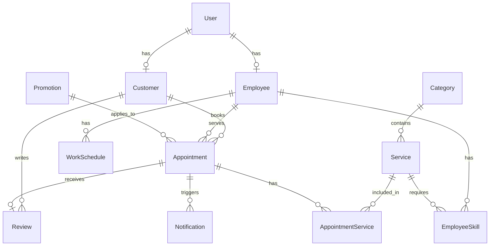

# TÀI LIỆU YÊU CẦU SẢN PHẨM (PRD)
## Hệ thống Website YURI SPA BEAUTY

| Thông tin | Chi tiết |
|---|---|
| **Tên dự án** | YURI SPA BEAUTY - Website Đặt lịch & Quản lý Dịch vụ Spa |
| **Phiên bản** | 1.0 (MVP) |
| **Ngày tạo** | 14/05/2026 |
| **Trạng thái** | Phase 1 - Hoàn thành |

---

## 1. Tổng quan dự án

### 1.1 Mục tiêu
Xây dựng hệ thống Website phục vụ cho **1 cơ sở** kinh doanh dịch vụ làm đẹp (Spa, Nail, Massage, Nối mi, Gội đầu, Chăm sóc da) với các mục tiêu:

- Cho phép khách hàng **đặt lịch trực tuyến** 24/7
- Cung cấp hệ thống **quản trị** cho chủ cơ sở: quản lý lịch hẹn, dịch vụ, nhân viên, khách hàng
- Hiển thị thông tin cửa hàng, danh sách dịch vụ, bảng giá, chương trình khuyến mãi
- Hỗ trợ **nhắc lịch tự động** qua Zalo OA (Phase 2)

### 1.2 Đối tượng người dùng

| Vai trò | Mô tả | Quyền hạn |
|---|---|---|
| **Khách hàng** | Người sử dụng dịch vụ Spa | Xem dịch vụ, đặt lịch, đăng ký tài khoản |
| **Nhân viên (Staff)** | Nhân viên thực hiện dịch vụ | Xem lịch làm việc cá nhân |
| **Quản trị viên (Admin)** | Chủ/quản lý cơ sở | Toàn quyền quản trị hệ thống |

### 1.3 Công nghệ sử dụng

| Thành phần | Công nghệ |
|---|---|
| Framework | Next.js 15+ (App Router, TypeScript) |
| Database | SQLite (Dev) / PostgreSQL (Production) + Prisma ORM |
| Authentication | NextAuth.js v5 (Credentials Provider) |
| Styling | Vanilla CSS, Google Fonts (Be Vietnam Pro) |
| Ngôn ngữ giao diện | Tiếng Việt |
| Thanh toán | Không yêu cầu thanh toán online |
| Thông báo | Zalo OA (Phase 2) |

---

## 2. Kiến trúc hệ thống

### 2.1 Cấu trúc thư mục

```
yu-spa-beauty/
├── prisma/
│   ├── schema.prisma          # 14 bảng dữ liệu
│   ├── seed.ts                # Dữ liệu mẫu
│   └── migrations/
├── src/
│   ├── app/
│   │   ├── (public)/          # 6 trang công khai
│   │   ├── (auth)/            # 2 trang xác thực
│   │   ├── admin/             # 6 trang quản trị
│   │   └── api/               # API routes
│   ├── actions/               # 4 Server Actions (CRUD)
│   ├── components/layout/     # Header, Footer
│   ├── lib/                   # Prisma client, Auth, Utils
│   └── types/                 # TypeScript definitions
└── public/images/             # Hình ảnh placeholder
```

### 2.2 Database Schema (14 Models)



**Chi tiết các bảng:**

| Model | Mô tả | Trường quan trọng |
|---|---|---|
| `User` | Tài khoản người dùng | email, phone, password, role (ADMIN/STAFF/CUSTOMER) |
| `Customer` | Thông tin mở rộng KH | memberLevel, totalVisits, totalSpent, notes |
| `Employee` | Thông tin nhân viên | position, experience, bio, isAvailable |
| `Category` | Danh mục dịch vụ | name, slug, icon, sortOrder |
| `Service` | Dịch vụ | name, price, discountPrice, duration, isFeatured |
| `EmployeeSkill` | Kỹ năng NV (M-N) | employeeId, serviceId, proficiency |
| `WorkSchedule` | Lịch làm việc | dayOfWeek, startTime, endTime |
| `Appointment` | Lịch hẹn | status (PENDING→CONFIRMED→IN_PROGRESS→COMPLETED/CANCELLED) |
| `AppointmentService` | DV trong lịch hẹn (M-N) | price, duration |
| `Review` | Đánh giá | rating (1-5), comment |
| `Promotion` | Khuyến mãi | code, type (PERCENTAGE/FIXED), value |
| `Notification` | Thông báo | type, channel (ZALO/EMAIL/SMS), status |
| `StoreSetting` | Cấu hình cửa hàng | key-value pairs |

---

## 3. Yêu cầu chức năng chi tiết

### 3.1 Giao diện công khai (Public)

#### F01 — Trang chủ (`/`)
- **Hero Section**: Banner chính với CTA "Đặt lịch ngay", slogan, hình ảnh
- **Thống kê**: 5+ năm KN, 2K+ khách hàng, 4.9 đánh giá
- **Dịch vụ nổi bật**: Grid 3 cột, load từ DB (`isFeatured = true`), hiển thị ảnh + giá + thời gian
- **Tại sao chọn chúng tôi**: 4 card điểm mạnh
- **Đánh giá khách hàng**: Load reviews từ DB (rating ≥ 4), fallback dữ liệu mẫu
- **CTA cuối trang**: Gradient background với nút đặt lịch

#### F02 — Trang dịch vụ (`/dich-vu`)
- Hiển thị **tất cả dịch vụ** nhóm theo danh mục
- Mỗi dịch vụ: ảnh, tên, mô tả, giá, thời gian thực hiện
- Click vào → chuyển sang trang chi tiết

#### F03 — Chi tiết dịch vụ (`/dich-vu/[slug]`)
- Thông tin đầy đủ: mô tả, giá, thời gian, danh mục
- Nút CTA "Đặt lịch dịch vụ này"
- Dịch vụ liên quan cùng danh mục

#### F04 — Bảng giá (`/bang-gia`)
- Bảng giá theo từng danh mục
- Hiển thị: tên dịch vụ, thời gian, giá gốc, giá khuyến mãi (nếu có)

#### F05 — Giới thiệu (`/gioi-thieu`)
- Lịch sử thương hiệu, sứ mệnh, giá trị cốt lõi
- Hình ảnh cơ sở
- Các con số thống kê nổi bật

#### F06 — Liên hệ (`/lien-he`)
- Thông tin: địa chỉ, SĐT, email, giờ làm việc
- Form liên hệ (tên, SĐT, nội dung)
- Bản đồ Google Maps nhúng

---

### 3.2 Đặt lịch online (Booking Engine)

#### F07 — Trang đặt lịch (`/dat-lich`)

**Luồng đặt lịch 4 bước:**

| Bước | Nội dung | Validation |
|---|---|---|
| **1. Chọn dịch vụ** | Checkbox multi-select, nhóm theo danh mục, hiển thị giá + thời gian | Tối thiểu 1 dịch vụ |
| **2. Chọn nhân viên** | Radio select, option "Bất kỳ nhân viên", hiển thị avatar | Không bắt buộc |
| **3. Chọn thời gian** | Date picker (≥ hôm nay) + Time slots grid (09:00-18:30, bước 30 phút) | Bắt buộc cả ngày và giờ |
| **4. Thông tin KH** | Họ tên, SĐT, ghi chú. Tóm tắt đặt lịch trước khi xác nhận | Bắt buộc tên + SĐT |

- **Summary bar**: Hiển thị liên tục ở bước 1-3: số dịch vụ đã chọn, tổng thời gian, tổng tiền
- **Trang xác nhận**: Hiển thị thông tin chi tiết sau khi đặt thành công
- **Trạng thái mặc định**: `PENDING` (chờ Admin xác nhận)

---

### 3.3 Xác thực (Authentication)

#### F08 — Đăng nhập (`/dang-nhap`)
- Đăng nhập bằng Email/SĐT + Mật khẩu
- NextAuth.js Credentials Provider
- Redirect theo role: Admin → `/admin`, Customer → `/`

#### F09 — Đăng ký (`/dang-ky`)
- Đăng ký tài khoản khách hàng mới
- Thông tin: Họ tên, SĐT, Email (tùy chọn), Mật khẩu
- Tự động tạo Customer profile kèm User

#### F10 — Phân quyền (Middleware)
- Route `/admin/*` → yêu cầu role `ADMIN`
- Route `/tai-khoan/*` → yêu cầu đăng nhập
- Public routes: tự do truy cập

---

### 3.4 Quản trị (Admin Dashboard)

#### F11 — Tổng quan (`/admin`)
- **4 KPI Cards**: Lịch hẹn hôm nay, Tổng khách hàng, Doanh thu tháng, Lượt đặt tháng
- **Bảng lịch hẹn gần đây**: 5 record mới nhất, hiển thị trạng thái màu sắc

#### F12 — Quản lý lịch hẹn (`/admin/lich-hen`)

| Chức năng | Mô tả |
|---|---|
| Xem danh sách | Bảng đầy đủ: KH, SĐT, dịch vụ, NV, ngày giờ, trạng thái, số tiền |
| Thống kê nhanh | Badges đếm theo trạng thái (Chờ, Đã xác nhận, Đang thực hiện, ...) |
| Chuyển trạng thái | PENDING → CONFIRMED → IN_PROGRESS → COMPLETED (hoặc CANCELLED) |
| Ghi chú nội bộ | Staff note cho mỗi lịch hẹn |
| Xóa | Chỉ cho phép xóa lịch hẹn đã Hoàn thành hoặc đã Hủy |

**Luồng trạng thái lịch hẹn:**
```
PENDING ──→ CONFIRMED ──→ IN_PROGRESS ──→ COMPLETED
   │              │                            
   └──→ CANCELLED └──→ CANCELLED              
```

#### F13 — Quản lý dịch vụ (`/admin/dich-vu`)

| Chức năng | Mô tả |
|---|---|
| Danh sách | Bảng: tên, danh mục, giá, thời gian, trạng thái, nổi bật |
| Thêm dịch vụ | Modal form: tên, danh mục, mô tả, giá, giá KM, thời gian, nổi bật |
| Sửa dịch vụ | Modal form pre-filled với dữ liệu hiện tại |
| Toggle Ẩn/Hiện | Bật/tắt trạng thái `isActive` |
| Toggle Nổi bật | Bật/tắt `isFeatured` (hiển thị trên trang chủ) |
| Xóa dịch vụ | Soft delete (set `isActive = false`) |
| Category badges | Hiển thị tổng số dịch vụ theo từng danh mục |

#### F14 — Quản lý nhân viên (`/admin/nhan-vien`)

| Chức năng | Mô tả |
|---|---|
| Danh sách | Card grid 3 cột: avatar, tên, vị trí, SĐT, kinh nghiệm, kỹ năng, lịch làm |
| Thêm nhân viên | Modal: Họ tên, SĐT, Email, Mật khẩu, Vị trí, KN, Giới thiệu, Kỹ năng (checkbox theo danh mục DV) |
| Sửa nhân viên | Modal pre-filled + cập nhật kỹ năng |
| Toggle Nghỉ/Làm | Bật/tắt `isActive` trên User |
| Kỹ năng | Gán multi-select dịch vụ mà NV thực hiện được |
| Lịch làm mặc định | T2-T7, 09:00-19:00 (tạo tự động khi thêm NV) |

#### F15 — Quản lý khách hàng (`/admin/khach-hang`)

| Chức năng | Mô tả |
|---|---|
| Thống kê | Tổng KH, KH mới tháng này, phân bổ theo hạng |
| Tìm kiếm | Tìm theo tên, SĐT, email |
| Danh sách | Bảng: tên, liên hệ, lượt đến, tổng chi tiêu, hạng, lần cuối, ghi chú |
| Đổi hạng | Dropdown: Thường → Bạc → Vàng → VIP |
| Ghi chú | Modal textarea: sở thích, dị ứng, yêu cầu đặc biệt |

**Hạng thành viên:**
| Hạng | Mã | Tiêu chí (gợi ý) |
|---|---|---|
| Thường | STANDARD | Mặc định |
| Bạc | SILVER | ≥ 5 lần / ≥ 2tr |
| Vàng | GOLD | ≥ 15 lần / ≥ 5tr |
| VIP | VIP | ≥ 30 lần / ≥ 10tr |

#### F16 — Thống kê (`/admin/thong-ke`)

| Chức năng | Mô tả |
|---|---|
| Tổng quan | 4 cards: Tổng doanh thu, Tổng lịch hẹn, Tổng KH, TB/lịch hẹn |
| Biểu đồ doanh thu | Bar chart 6 tháng gần nhất (doanh thu + số đơn) |
| Top dịch vụ | 5 dịch vụ được đặt nhiều nhất (tên, số lượt, doanh thu) |
| Top nhân viên | 5 NV có nhiều lịch hẹn hoàn thành nhất (tên, số đơn, doanh thu) |

---

## 4. Yêu cầu phi chức năng

### 4.1 Giao diện & UX
- **Responsive**: Tương thích Desktop, Tablet, Mobile
- **Design System**: Tông màu Lavender (#a855f7) + Pink (#ec4899), gradient background
- **Font**: Be Vietnam Pro (hỗ trợ đầy đủ tiếng Việt)
- **Animations**: Fade-in, slide-up cho các section, hover effects
- **Toast notifications**: Phản hồi realtime cho mọi thao tác CRUD

### 4.2 Hiệu năng
- Server Components cho data fetching (giảm JS client)
- `revalidatePath` sau mỗi mutation
- Image optimization qua Next.js `<Image>`

### 4.3 Bảo mật
- Mật khẩu hash bằng `bcryptjs`
- Middleware bảo vệ route admin
- Server Actions cho tất cả write operations
- CUID cho ID (không lộ thứ tự)

---

## 5. Dữ liệu mẫu (Seed Data)

| Loại | Số lượng | Chi tiết |
|---|---|---|
| Admin | 1 | admin@yurispabeauty.vn / admin123 |
| Nhân viên | 3 | Lan (Da liễu), Thư (Nail), Nhung (Spa) |
| Danh mục | 5 | Chăm sóc da, Làm móng, Nối mi, Massage & Spa, Gội đầu |
| Dịch vụ | 10+ | Giá 150K-550K, thời gian 30-90 phút |
| Khách hàng | 1 | Nguyễn Thị Mai, hạng Bạc |
| Placeholder images | 5 | Hero banner, Spa, Nail, Massage, Eyelash |

---

## 6. Sitemap & Routes

| Route | Loại | Mô tả |
|---|---|---|
| `/` | Public | Trang chủ |
| `/dich-vu` | Public | Danh sách dịch vụ |
| `/dich-vu/[slug]` | Public | Chi tiết dịch vụ |
| `/bang-gia` | Public | Bảng giá |
| `/gioi-thieu` | Public | Giới thiệu |
| `/lien-he` | Public | Liên hệ |
| `/dat-lich` | Public | Đặt lịch online |
| `/dang-nhap` | Auth | Đăng nhập |
| `/dang-ky` | Auth | Đăng ký |
| `/admin` | Protected | Dashboard tổng quan |
| `/admin/lich-hen` | Protected | Quản lý lịch hẹn |
| `/admin/dich-vu` | Protected | Quản lý dịch vụ |
| `/admin/nhan-vien` | Protected | Quản lý nhân viên |
| `/admin/khach-hang` | Protected | Quản lý khách hàng |
| `/admin/thong-ke` | Protected | Thống kê doanh thu |
| `/admin/khuyen-mai` | Protected | Quản lý khuyến mãi |
| `/tai-khoan` | Auth | Dashboard khách hàng |
| `/tai-khoan/lich-su` | Auth | Lịch sử đặt lịch |
| `/tai-khoan/danh-gia` | Auth | Đánh giá dịch vụ |

---

## 7. Lộ trình phát triển

### Phase 1 — MVP ✅ (Hoàn thành)
- [x] Setup dự án, Database schema, Seed data
- [x] 6 trang public (Trang chủ, Dịch vụ, Bảng giá, Giới thiệu, Liên hệ, Đặt lịch)
- [x] Booking engine 4 bước
- [x] Authentication (Đăng nhập/Đăng ký)
- [x] Admin Dashboard + CRUD đầy đủ (Dịch vụ, Nhân viên, Khách hàng, Lịch hẹn, Thống kê)
- [x] Responsive design, Vietnamese font support

### Phase 2 — Nâng cao ✅ (Hoàn thành)
- [x] Booking từ DB thực: đặt lịch ghi vào database, kiểm tra xung đột giờ
- [x] Quản lý khuyến mãi: CRUD Promotion, áp dụng mã giảm giá khi đặt lịch
- [x] Dashboard KH: xem lịch sử đặt lịch, đánh giá dịch vụ (`/tai-khoan`)
- [x] Email xác nhận đặt lịch (Nodemailer) + thông báo thay đổi trạng thái
- [x] Tích hợp Zalo OA: notification infrastructure + cron reminders (24h + 2h)

### Phase 3 — Mở rộng (Tương lai)
- [ ] Báo cáo chi tiết: xuất Excel, biểu đồ nâng cao
- [ ] Quản lý kho sản phẩm
- [ ] Chương trình loyalty: tích điểm, đổi quà
- [ ] Đa cơ sở (multi-branch)
- [ ] App mobile (React Native)
- [ ] Tích hợp thanh toán online (VNPay/MoMo)

---

## 8. Rủi ro & Giải pháp

| Rủi ro | Mức độ | Giải pháp |
|---|---|---|
| SQLite không scale cho production | Trung bình | Chuyển PostgreSQL khi deploy (Prisma hỗ trợ swap) |
| Xung đột lịch hẹn | Cao | Phase 2: kiểm tra slot availability trước khi book |
| Font tiếng Việt | Đã xử lý | Sử dụng Be Vietnam Pro (thiết kế cho tiếng Việt) |
| Modal bị cắt trong admin | Đã xử lý | React Portal render modal ra document.body |
| Bảo mật admin route | Thấp | Middleware NextAuth kiểm tra role |

---

*Tài liệu được tạo tự động dựa trên mã nguồn thực tế của dự án YURI SPA BEAUTY.*
